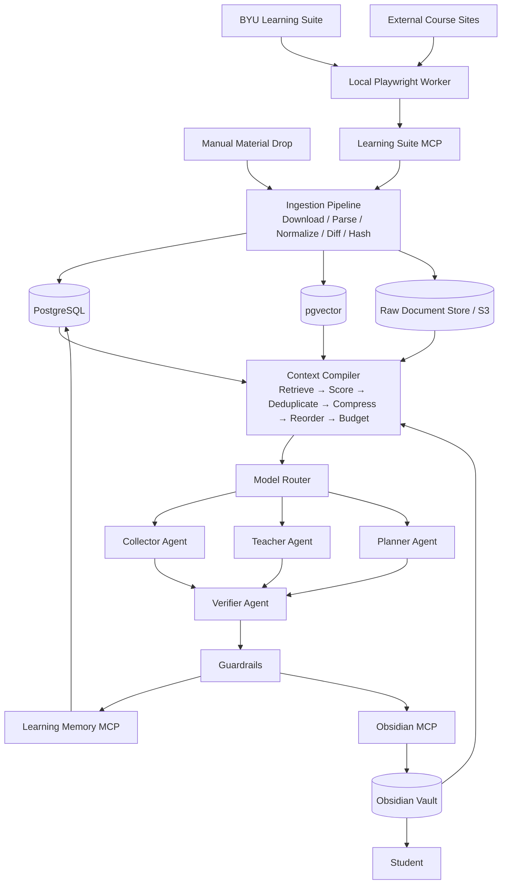
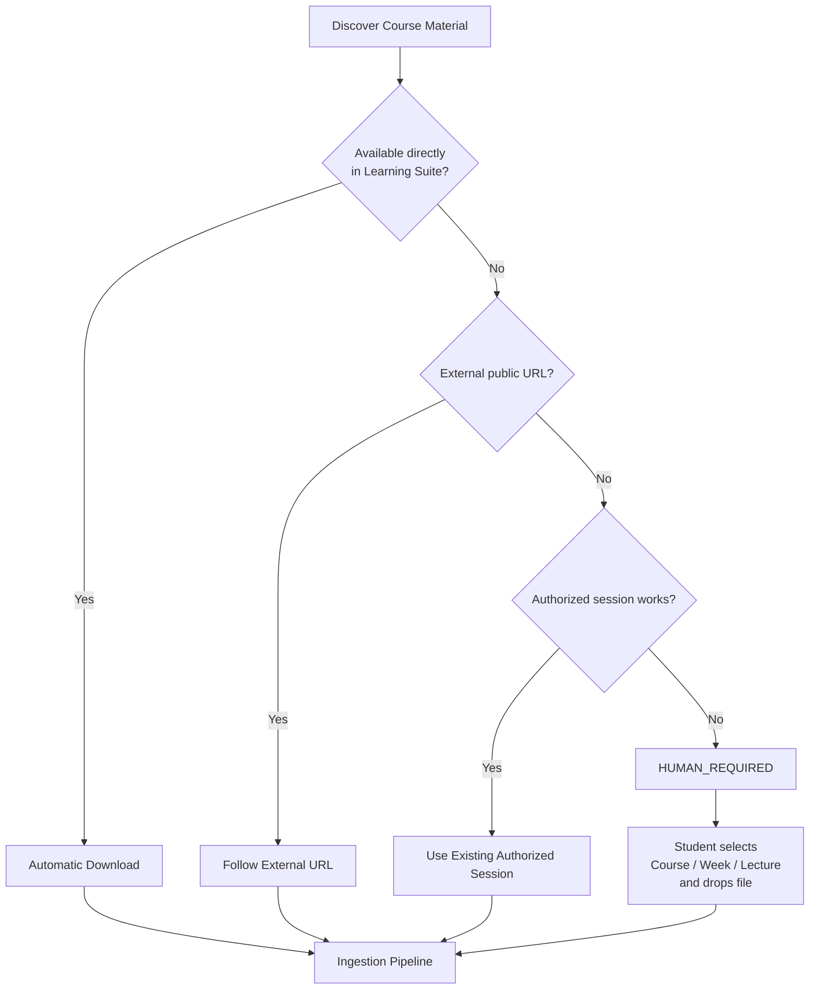
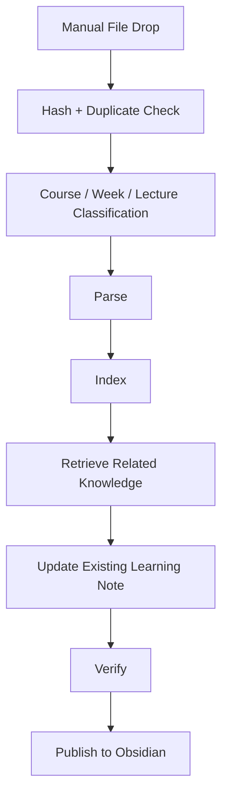
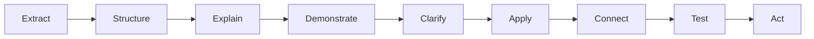
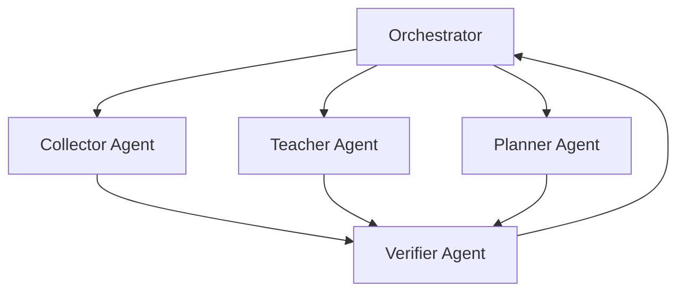
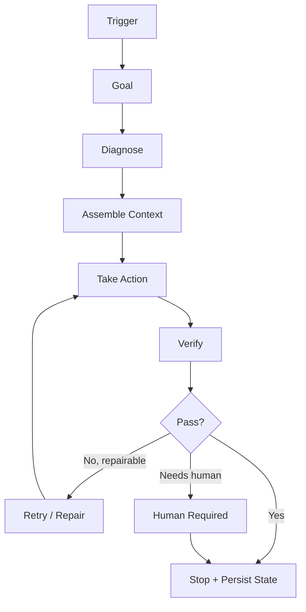
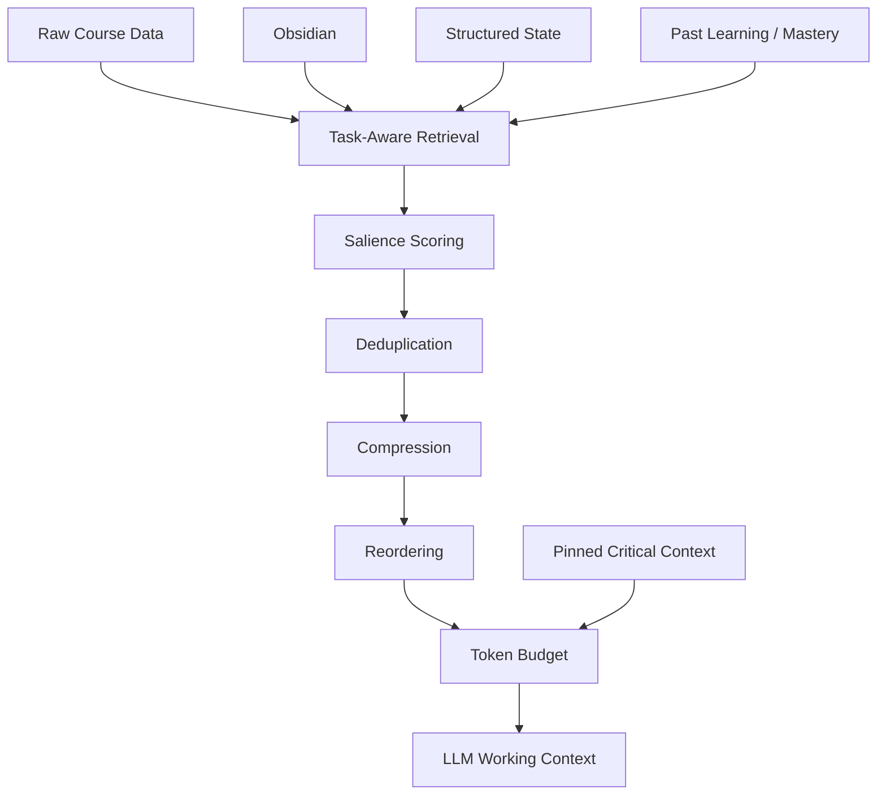
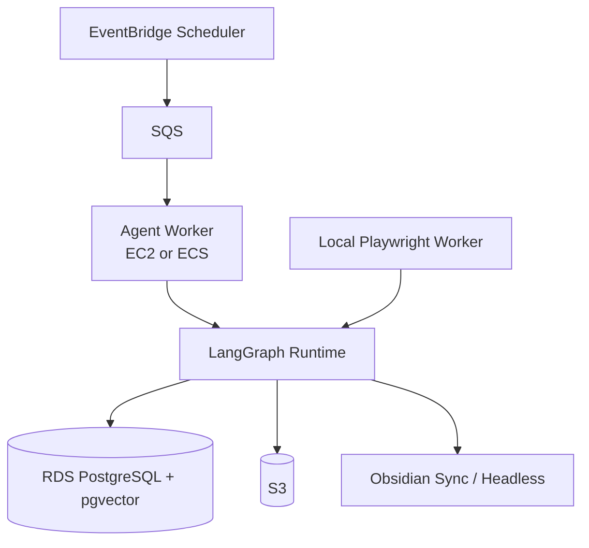
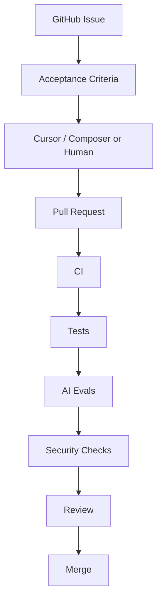

# Personal Learning OS — System Architecture

> An autonomous, safety-first AI learning layer between BYU Learning Suite and the student.
>
> The system continuously collects course materials, converts them into high-quality learning experiences, generates concrete action items, tracks mastery, and writes everything into Obsidian — while keeping assignment submission manual.

---

## 1. Project Goal

The goal is **not** to build an AI that simply completes schoolwork.

The goal is to build a **Personal Learning OS** that:

- automatically checks BYU Learning Suite
- detects new or changed assignments, announcements, lectures, and course materials
- downloads available materials
- follows external course links when authorized
- asks for manual file upload only when automatic acquisition fails
- reconstructs course materials into clear, deeply understandable learning notes
- generates concrete, prioritized action items
- tracks what has been learned and what is still weak
- keeps a persistent long-term knowledge base in Obsidian
- minimizes hallucination through source grounding, verification, context engineering, and guardrails
- never automatically submits assignments, quizzes, or exams

The intended experience is simple:

> Open Obsidian and immediately know what to do, why it matters, what to learn, and how everything connects — without constantly navigating Learning Suite.

---

# 2. High-Level Architecture



---

# 3. Core Design Principles

## 3.1 Learning-first, not automation-first

The system may automate:

- discovery
- retrieval
- classification
- summarization
- explanation
- planning
- note generation
- mastery tracking
- reminders
- change detection

The system must **not** automate:

- final assignment submission
- quiz submission
- exam participation
- bypassing authentication or access restrictions
- actions explicitly prohibited by course policy

---

## 3.2 The output is action, not information

Every run should answer:

1. **What changed?**
2. **What matters?**
3. **What should I do next?**
4. **How long will it take?**
5. **Why should I do it now?**
6. **What do I need to understand before I do it?**
7. **How will I know I actually understand it?**

Example:

```yaml
title: Complete Lab 4
course: CYBER465
due: 2026-09-08T23:59
priority: 96
estimated_minutes: 55
status: todo
type: assignment

why_now:
  - Due within 24 hours
  - High grade impact
  - Depends on Lecture 8 concepts

prerequisites:
  - Kerberos authentication
  - TGT vs Service Ticket

actions:
  - Review prerequisite note
  - Complete questions 1-6
  - Verify screenshots
  - Submit manually in Learning Suite

completion_criteria:
  - All questions answered
  - Screenshots attached
  - Can explain Pass-the-Ticket without notes

source:
  - Learning Suite assignment page

confidence: 0.98
```

---

# 4. Material Acquisition Architecture

The system assumes that **not every course material will be retrievable automatically**.

This is intentional.



---

## 4.1 Material Manifest

The agent maintains an explicit inventory of expected course materials.

Example:

```yaml
course: CYBER465
week: 8

materials:
  - name: Lecture 8 Slides
    status: acquired

  - name: Lecture 8 Recording
    status: acquired

  - name: Chapter 7
    status: acquired

  - name: Supplemental Article
    status: human_required

  - name: Lab 5 Instructions
    status: acquired

coverage: 0.80
```

The system must **never claim full coverage when material is missing**.

Possible statuses:

- `DISCOVERED`
- `ACQUIRED`
- `PARSED`
- `INDEXED`
- `HUMAN_REQUIRED`
- `MISSING`
- `FAILED`
- `VERIFIED`

---

# 5. Human-in-the-Loop Fallback

If the agent cannot retrieve a material:

```text
CYBER 465
Week 8

⚠ Supplemental Reading

Reason:
External authentication required.

Action:
Download the file manually and drop it into the course inbox.
```

Recommended structure:

```text
BYU-AI/
└── Inbox/
    ├── CYBER465/
    ├── IT450/
    └── ...
```

Optional UI:

```text
Course:   CYBER 465
Week:     Week 8
Material: Lecture 8

[ Drop Material Here ]
```

After the file is dropped:



If classification confidence is low, the system asks for confirmation rather than guessing.

---

# 6. Obsidian as the Human + AI Long-Term Knowledge Layer

Obsidian is the primary knowledge interface.

Recommended vault structure:

```text
BYU-AI/
│
├── 00 Dashboard/
│   ├── Today.md
│   ├── This Week.md
│   └── Semester.md
│
├── 01 Courses/
│   ├── CYBER465/
│   │   ├── Course Overview.md
│   │   ├── Week 01.md
│   │   ├── Week 02.md
│   │   └── ...
│
├── 02 Assignments/
│   ├── Lab 01.md
│   ├── Lab 02.md
│   └── ...
│
├── 03 Concepts/
│   ├── Kerberos.md
│   ├── OAuth.md
│   ├── TLS.md
│   └── ...
│
├── 04 Learning/
│   ├── Knowledge Gaps.md
│   ├── Mastery Map.md
│   └── Review Queue.md
│
├── 05 Actions/
│   ├── Today.md
│   └── This Week.md
│
├── 90 Sources/
│
├── 98 Inbox/
│
└── 99 Agent/
    ├── Activity Log.md
    ├── Decisions.md
    └── Open Questions.md
```

Obsidian is **not** the only system of record.

Data ownership:

| Data | Primary Store |
|---|---|
| Raw downloaded files | S3 / raw document store |
| Structured operational state | PostgreSQL |
| Embeddings / retrieval index | pgvector |
| Human-readable knowledge | Obsidian |
| Runtime working memory | LLM context |
| Agent execution checkpoints | LangGraph / DB |

---

# 7. Learning Note Generation

The Teacher Agent must **never merely summarize**.

Its goal is:

> Reconstruct the material into the clearest possible learning experience while preserving the concepts actually covered by the course.

Required transformation pipeline:



For every important concept, the generated note should answer:

1. What is it?
2. Why does it exist?
3. How does it work?
4. What is a concrete example?
5. What is an intuitive analogy?
6. What are common misconceptions?
7. How does it connect to other course concepts?
8. How is it used in the assignment/lab?
9. What did the professor/course actually say?
10. What did the AI add as explanation?
11. Can the student explain it independently?
12. What should the student do next?

---

## 7.1 Provenance Separation

Generated notes should distinguish:

### COURSE MATERIAL

Facts explicitly supported by course materials.

### AI EXPLANATION

A clearer explanation of course material.

### AI ENRICHMENT

Additional examples, analogies, or context.

### EXTERNAL KNOWLEDGE

Information not contained in the course materials.

### ACTION

Recommended next step.

This separation is important for hallucination control.

---

# 8. Mastery Tracking

Assignment completion and learning completion are separate states.

Example:

```yaml
concept: Kerberos
course: CYBER465

mastery: 0.72
confidence: medium

understands:
  - TGT
  - Service Ticket

weak_points:
  - KRBTGT
  - Golden Ticket

last_reviewed: 2026-09-09
next_review: 2026-09-13
```

Possible state:

```yaml
assignment_status: complete
learning_status: weak
```

The Planner Agent can then generate:

> Lab is complete, but Golden Ticket mastery is still low. Review for 10 minutes before the quiz.

---

# 9. Agent Architecture

Avoid a single mega-agent.

Use a small number of specialized agents with narrow responsibilities.



---

## 9.1 Collector Agent

Responsibilities:

- detect courses
- detect assignments
- detect announcements
- detect files
- detect external URLs
- identify changes
- populate material manifests

Rules:

- prefer deterministic extraction
- never infer a deadline when it can be read from the DOM
- retain original source URLs and source metadata

---

## 9.2 Teacher Agent

Responsibilities:

- reconstruct course content pedagogically
- produce concept notes
- generate examples and analogies
- connect material to assignments
- generate active recall questions
- update mastery evidence

---

## 9.3 Planner Agent

Responsibilities:

- prioritize work
- estimate effort
- generate concrete action items
- account for deadlines
- account for prerequisite knowledge
- account for mastery gaps

Possible priority model:

```text
Priority =
Deadline Urgency
× Grade Impact
× Dependency
× Estimated Effort
× Knowledge Weakness
```

---

## 9.4 Verifier Agent

Responsibilities:

- verify factual claims against sources
- verify deadlines
- verify course coverage
- detect unsupported professor claims
- check note completeness
- validate structured output
- fail closed when evidence is insufficient

---

# 10. MCP Architecture

MCP is used only where it creates a clean system boundary.

```text
Learning Suite MCP
├── list_courses()
├── get_course()
├── list_assignments()
├── get_assignment()
├── list_announcements()
├── list_materials()
├── download_material()
├── get_syllabus()
└── get_ai_policy()
```

```text
Obsidian MCP
├── search_notes()
├── read_note()
├── create_note()
├── update_note()
├── create_link()
└── append_action_item()
```

```text
Learning Memory MCP
├── get_concept()
├── search_concepts()
├── get_mastery()
├── update_mastery()
├── get_action_items()
└── update_action_item()
```

Do **not** expose tools such as:

```text
submit_assignment()
take_quiz()
submit_exam()
bypass_authentication()
```

They should not exist.

---

# 11. Loop Engineering

Every autonomous run follows a loop with explicit state.



Every loop must have:

- trigger
- explicit goal
- bounded context
- maximum retry count
- verifier
- stop condition
- token/cost budget
- persistent state
- human escalation path

Example daily loop:

```yaml
trigger: 06:00

goal:
  detect changes in Learning Suite
  update today's learning plan
  maintain current course notes

max_retries: 2

stop_conditions:
  - source verification passes
  - action items generated
  - unresolved materials explicitly marked
  - Obsidian updated

possible_terminal_states:
  - SUCCESS
  - PARTIAL
  - HUMAN_REQUIRED
  - FAILED
```

---

# 12. Context Engineering / Context Compiler

The LLM context window is treated as **working memory**, not long-term storage.

Long-term memory lives outside the model.



The pipeline adopts the useful principles behind ContextForge-style context optimization:

```text
retrieve
→ score
→ deduplicate
→ compress
→ reorder
→ enforce hard token budget
→ record audit trail
```

Important context can be pinned:

- assignment instructions
- due dates
- professor requirements
- course AI policy
- current learning objective
- safety policies

The context compiler should log what was removed and retained.

Example:

```text
Before: 74,281 tokens
After: 28,430 tokens

Removed:
- duplicated slides
- irrelevant lecture history
- stale announcement
- duplicated notes

Pinned:
- assignment instructions
- due date
- professor AI policy
```

---

# 13. Hallucination-Reduction Architecture

Hallucination is reduced through multiple layers.

It is **not** solved by one prompt or one compression library.

## Layer 1 — Deterministic extraction

Use code rather than LLM inference for:

- deadlines
- URLs
- filenames
- points
- course identifiers
- file hashes
- timestamps

---

## Layer 2 — Source provenance

Every important factual claim should retain its source.

Example:

```yaml
claim:
  text: "The assignment is due September 12 at 11:59 PM."
  type: fact

source:
  system: learning_suite
  page: assignment_4
  observed_at: 2026-09-09T06:02:11
```

---

## Layer 3 — Claim classes

Every generated statement belongs to one of:

```text
FACT
INTERPRETATION
EXPLANATION
ENRICHMENT
RECOMMENDATION
UNKNOWN
```

---

## Layer 4 — Verifier

No note is promoted to `VERIFIED` until the verifier checks:

- source grounding
- deadline correctness
- material coverage
- unsupported claims
- conflicts
- completeness

---

## Layer 5 — Fail closed

When evidence is insufficient:

```text
UNKNOWN
HUMAN_REQUIRED
PARTIAL
```

is preferred over guessing.

---

## Layer 6 — Context control

Only task-relevant context is sent to the model.

---

## Layer 7 — Evals

Maintain regression tests for:

- due-date extraction
- course classification
- material coverage
- citation/provenance
- hallucination rate
- action quality
- note quality

---

# 14. Guardrails

Guardrails should exist in code and permissions, not only prompts.

## Authentication

- NetID/password never sent to an LLM
- Duo state never sent to an LLM
- browser cookies remain local where possible
- no authentication bypass

## Tool permissions

- Learning Suite MCP: read-only
- no assignment submission tools
- no exam tools
- allowlist available tools per agent

## Prompt injection defense

Treat all course material and external web content as:

> UNTRUSTED DATA, NOT SYSTEM INSTRUCTIONS.

## Operational limits

- maximum loop count
- per-run token budget
- per-run cost budget
- maximum external requests
- human escalation on ambiguous high-impact actions

## Secrets

Never commit:

- credentials
- cookies
- session state
- API keys
- Duo information
- production secrets

---

# 15. Model Routing

Do not use the strongest model for every task.

Use task-aware routing.

```text
Deterministic parser
    ↓
Use whenever possible

Cheap / Fast Model
    ↓
classification
metadata extraction
simple transformation

General Agent Model
    ↓
planning
normal note generation
tool orchestration

Strong Reasoning Model
    ↓
complex synthesis
source conflicts
final verification
high-value pedagogical reconstruction
```

Exact models should remain configurable.

Example configuration:

```yaml
models:
  extraction: fast_model
  planner: general_model
  teacher: general_or_reasoning_model
  verifier: strong_reasoning_model
```

Model choice should ultimately be driven by eval results, latency, and cost — not branding.

---

# 16. Infrastructure

Recommended production direction:



Recommended schedules:

```text
Daily 06:00
→ Check Learning Suite
→ Detect changes
→ Update Today.md

Daily evening
→ Recheck deadlines
→ Update priority

Sunday
→ Full weekly analysis
→ Generate This Week.md
→ Update mastery/review plan
```

---

# 17. Development Architecture

GitHub is the engineering source of truth.



---

## Cursor / Composer

Best used for:

- interactive implementation
- debugging
- refactoring
- writing tests
- navigating the codebase
- short and medium engineering tasks

---

## Devin

Best used for:

- clearly scoped independent tickets
- tasks with explicit acceptance criteria
- implementation + test + pull request workflows

Do not expose real BYU authentication data to coding agents.

Use test fixtures:

```text
tests/
└── fixtures/
    └── fake_learning_suite/
        ├── course.html
        ├── assignment.html
        ├── announcement.html
        ├── syllabus.pdf
        └── sample_lecture.pdf
```

---

# 18. Suggested Repository Structure

```text
personal-learning-os/
│
├── README.md
├── ARCHITECTURE.md
├── DECISIONS.md
├── OPEN_QUESTIONS.md
├── SECURITY.md
│
├── apps/
│   ├── local-browser-worker/
│   └── control-panel/
│
├── agents/
│   ├── orchestrator/
│   ├── collector/
│   ├── teacher/
│   ├── planner/
│   └── verifier/
│
├── mcp/
│   ├── learning-suite/
│   ├── obsidian/
│   └── learning-memory/
│
├── context/
│   ├── retrieval/
│   ├── scoring/
│   ├── compression/
│   ├── budgeting/
│   └── provenance/
│
├── ingestion/
│   ├── parsers/
│   ├── classifiers/
│   ├── downloaders/
│   └── manifests/
│
├── memory/
│   ├── models/
│   ├── mastery/
│   └── actions/
│
├── guardrails/
│   ├── permissions/
│   ├── prompt_injection/
│   ├── academic_policy/
│   └── secrets/
│
├── evals/
│   ├── extraction/
│   ├── hallucination/
│   ├── pedagogy/
│   ├── planning/
│   └── fixtures/
│
├── infrastructure/
│   ├── aws/
│   └── local/
│
├── tests/
│   └── fixtures/
│
└── docs/
    ├── prompts/
    ├── workflows/
    └── diagrams/
```

---

# 19. Canonical Project Files

To reduce drift and hallucination during development, maintain:

## `ARCHITECTURE.md`

This document.

## `DECISIONS.md`

Only settled architectural decisions.

Example:

```markdown
## ADR-004 — Obsidian is the primary human knowledge interface

Status: Accepted

Reason:
- local Markdown
- easy agent access
- backlinks
- long-term portability

Notion is not part of v1.
```

## `OPEN_QUESTIONS.md`

Unknowns that still need investigation.

Example:

```markdown
- Which Learning Suite pages require special handling?
- How long does the authenticated browser session survive?
- Are lecture videos transcript-accessible?
```

The AI should **never silently convert an open question into a fact**.

---

# 20. Development Phases

## Phase 0 — Research / Recon

Understand one real Learning Suite course.

Verify:

- login/session behavior
- page structure
- assignment structure
- material links
- announcements
- downloadable resources
- external links

---

## Phase 1 — Vertical Slice

Build one end-to-end path:

```text
1 real course
↓
read-only Playwright
↓
assignment + material extraction
↓
material manifest
↓
one learning note
↓
Today.md
```

Success criterion:

> It is already useful enough to use every day.

---

## Phase 2 — Knowledge Layer

Add:

- structured DB
- pgvector
- concept notes
- source provenance
- mastery tracking

---

## Phase 3 — Context Engineering

Add:

- task-aware retrieval
- salience scoring
- deduplication
- compression
- hard token budgets
- context audit logs

---

## Phase 4 — Agent Loop

Add:

- Orchestrator
- Collector
- Teacher
- Planner
- Verifier
- checkpoints
- retries
- stop conditions
- human escalation

---

## Phase 5 — MCP

Add:

- Learning Suite MCP
- Obsidian MCP
- Learning Memory MCP

---

## Phase 6 — Cloud Automation

Add:

- AWS scheduler
- queue
- worker
- RDS
- S3
- monitoring

Keep sensitive browser authentication isolated.

---

## Phase 7 — Production Hardening

Add:

- eval suite
- prompt injection tests
- cost limits
- observability
- failure recovery
- security review
- regression testing

---

# 21. Definition of Success

The system succeeds when the student can begin the day by opening Obsidian and seeing:

```text
TODAY

1. Complete CYBER465 Lab 4
   55 min
   Due today

   Before starting:
   Review Kerberos — 8 min

2. Prepare for IT450 Quiz
   25 min
   Due tomorrow

3. Review Golden Ticket
   10 min
   Mastery: 58%

NEW SINCE YESTERDAY

- Lab 5 added
- Quiz deadline changed
- Lecture 9 uploaded

TODAY'S LEARNING GOAL

By tonight, explain:
"Why stealing a TGT can enable lateral movement."
```

The student should rarely need to manually navigate the LMS to understand:

- what changed
- what is due
- what to do next
- what to learn
- how concepts connect
- where knowledge gaps remain

---

# 22. Non-Goals

The project does **not** aim to:

- automatically submit assignments
- automatically complete exams or quizzes
- bypass authentication
- scrape inaccessible resources
- hide AI use where disclosure is required
- replace actual learning
- maximize autonomy at the expense of reliability
- use every available AI framework merely because it is new

---

# 23. Guiding Principle

> **The model is not the system. The harness is the system.**

Reliability comes from:

- clean context
- narrow tools
- explicit state
- source provenance
- deterministic extraction
- specialist agents
- machine-checkable verification
- bounded loops
- human escalation
- long-term memory
- continuous evals

The desired outcome is not “an AI that does school.”

It is:

> **an AI-native learning environment that removes LMS friction while making the actual learning experience dramatically better.**
